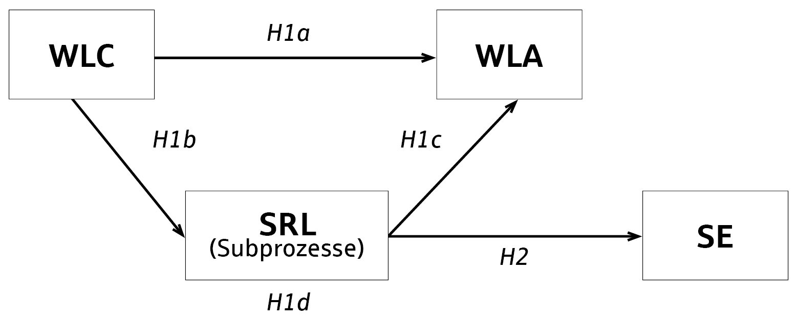

```{r setup, include=FALSE}
knitr::opts_chunk$set(echo = TRUE)
```

# Voraussetzungen {.unnumbered}

Alle verwendeten Dateien und Code sind in einem gesonderten [GitHub Repository](https://github.com/hudracyador/workpl_srl_thesis_phhd) verfügbar.

## Verwendete Software-Versionen {.unnumbered}

Die bei Erstellung dieses Dokuments und in Datenaufbereitung sowie -analyse zugrundeliegenden Session-Informationen bezüglich R und verwendeten Packages sind wie folgt.

```{r tidy=FALSE, echo=FALSE}
xfun::session_info(c(
  "knitr", "rmarkdown", "xfun", "readxl", "dplyr", "scales", "missMethods",
  "psych", "ggplot2", "tidyverse", "tibble", "tidyr"
), dependencies = FALSE)
```

RStudio

``` yaml
RStudio 2023.09.1+494 "Desert Sunflower" Release 
(cd7011dce393115d3a7c3db799dda4b1c7e88711, 2023-10-16) for windows
Mozilla/5.0 (Windows NT 10.0; Win64; x64) AppleWebKit/537.36 (KHTML, like Gecko) 
RStudio/2023.09.1+494 Chrome/116.0.5845.190 Electron/26.2.4 Safari/537.36
```

## Benötigte R-Libraries {.unnumbered}

Die folgenden Bibliotheken bzw. Packages kommen im Rahmen der Datenaufbereitung und -analyse zum Einsatz.

``` yaml
library(readxl)
library(dplyr)
library(scales)
library(missMethods)
library(psych)
library(ggplot2)
library(tidyverse)
library(tibble)
library(tidyr)
```

# Datenerhebung

Die Zielpopulation dieser Studie sind Wissensarbeiter. Teilnehmende für die Umfrage wurden durch Zufallsstichproben gewonnen. Die Stichprobe für die Datensammlung bestand aus Wissensarbeitern, die in einer Dienstleistungs-Unternehmensgruppe im Bankenbereich tätig sind (n = 3.290). In Abstimmung mit der zuständigen Abteilung für Informationssicherheit & Datenschutz wurde der Fragebogen anonymisiert und im intern abgestimmten und geprüften Tool MS Forms erstellt. Über einen Unternehmensgruppe-weiten Intranet-Post wurde der [Link zum Fragebogen](https://forms.office.com/e/QmQ1MncGbK) an alle potenziellen Teilnehmenden bereitgestellt.

<details>

<summary>Intranet-Beitrag zur Ausbringung des Fragebogens</summary>


</details>

# Datenimport

```{r}
# Import the fully prepared xlsx file into RStudio
library(readxl)
df_srl <- read_excel("02_20231207_srlwq_deu.xlsx",
  sheet = "Tabelle1", range = "A1:BX133",
  na = "NA"
)

# Save a duplicate of the original data set for later
df_srl_dupl <- df_srl

# See, if all 76 columns are present in the imported data set
ncol(df_srl)

# See, if all 132 rows are present in the imported data set
# Original file has 133 rows, the import makes the first row header
# so does not count
nrow(df_srl)

# Create data frame with only missings
df_srl_just_na <- df_srl[rowSums(is.na(df_srl)) > 0, ]
```

# Datenaufbereitung

## Variablen umbenennen

```{r}
library(dplyr)

# Rename col descriptions to shorter and usable variable names
df_srl_col <- rename(
  df_srl,
  PD_00_ID = "ID",
  PD_01_age = "In welcher Altersgruppe befindest du dich?",
  PD_02_gender = "Welchem Geschlecht fühlst du dich zugehörig?",
  PD_03_employer = "In welchem Teil der DSVGruppe arbeitest du derzeit?",
  PD_04_work_yrs = "Wie viele Jahre bist du bereits bei deinem jetzigen Arbeitgeber innerhalb der DSVGruppe tätig?",
  PD_05_work_hrs = "Welche Erwerbssituation trifft auf dich zu?",
  PD_06_leader = "Bist du in einer fachlichen oder disziplinarischen Führungsposition?",
  PD_07_ho_amount = "Wie viel Prozent des Monats arbeitest du normalerweise von zu Hause aus?",
  WLA_08_info_acquire = "Neue Informationen beschaffen (z. B. durch Suche im Internet oder in der Wissensdatenbank des Unternehmens)",
  WLA_09_collab_solution = "Allein oder mit anderen zusammenarbeiten, um Lösungen für Probleme zu entwickeln",
  WLA_10_collab_ideas = "Allein oder mit anderen zusammen neue Ideen entwickeln",
  WLA_11_dev_field = "Neue Entwicklungen in deinem Fachgebiet verfolgen",
  WLA_12_new_tasks = "Neue Aufgaben ausführen",
  WLA_13_advice = "Kollegen um Rat fragen",
  WLA_14_self_study = "An einen Schulungskurs teilnehmen oder Materialien zum Selbststudium verwenden",
  WLA_15_copy_strategies = "Strategien von Kollegen beobachten oder kopieren, um eine Aufgabe zu erledigen oder ein Problem zu lösen",
  WLA_16_trial_error = "Durch Versuch und Irrtum einen besseren Weg finden, eine Aufgabe auszuführen",
  WLA_17_reflection = "Über früheres Handeln reflektieren",
  WLA_18_feedback = "Feedback von Kollegen zu deinen Aufgaben bekommen",
  SRL_F_19_personal_standards = "Ich setze persönliche Maßstäbe für die Leistung in meinem Job",
  SRL_F_20_long_term_goals = "Ich setze mir langfristige Ziele (monatlich oder jährlich), um meine Lernaktivitäten zu steuern",
  SRL_F_21_goals_time_learn = "Ich setze mir Ziele, die mir helfen, die Zeit, die ich mit Lernen verbringe, zu verwalten",
  SRL_F_22_deadlines = "Ich setze mir realistische Fristen für das Lernen, wenn ich einen Lernbedarf festgestellt habe.",
  SRL_F_23_question_self = "Ich stelle mir Fragen zu jeder Lernaufgabe, bevor ich beginne",
  SRL_F_24_dif_ways_solve = "Ich überlege mir mehrere Möglichkeiten zur Lösung eines Problems und wähle die beste aus",
  SRL_F_25_past_strategies = "Bei der Planung meines Lernens wende ich Strategien an, die sich in der Vergangenheit bewährt haben",
  SRL_F_26_spec_strategies = "Ich verwende spezifische Strategien für verschiedene Arten von Dingen, die ich lernen muss",
  SRL_F_27_apply_learned = "Ich denke, dass ich das, was ich in diesem Beruf lerne, in der Zukunft anwenden kann",
  SRL_F_28_learn_new = "Es ist wichtig für mich, in diesem Job neue Dinge zu lernen",
  SRL_F_29_learning_important = "Die Lernaktivitäten, die ich in diesem Job betreibe, sind wichtig für mich",
  SRL_F_30_difficulties_calm = "Ich kann bei Schwierigkeiten in meinem Job ruhig bleiben, weil ich mich auf meine Fähigkeiten verlassen kann.",
  SRL_F_31_problem_solutions = "Wenn ich in meinem Job mit einem Problem konfrontiert bin, kann ich normalerweise mehrere Lösungen dafür finden.",
  SRL_F_32_handle_whatever = "Was auch immer in meinem Job auf mich zukommt, ich kann es normalerweise bewältigen.",
  SRL_F_33_job_exp_future = "Meine bisherigen Erfahrungen in meinem Job haben mich gut auf meine berufliche Zukunft vorbereitet.",
  SRL_F_34_self_goals_set = "Ich erreiche die Ziele, die ich mir in meinem Job gesetzt habe.",
  SRL_F_35_job_demands = "Ich fühle mich auf die meisten Anforderungen in meinem Job vorbereitet.",
  SRL_P_36_plan_learning_goals = "Ich schreibe einen Plan, um zu beschreiben, wie ich meine Lernziele zu erreichen hoffe",
  SRL_P_37_rel_learn_now_past = "Ich hinterfrage, wie das, was ich gerade lerne, mit dem zusammenhängt, was ich bereits weiß.",
  SRL_P_38_change_strategies = "Ich ändere meine Strategien, wenn ich beim Lernen keine Fortschritte mache",
  SRL_P_39_make_notes = "Beim Lernen mache ich mir Notizen (einschließlich Diagramme usw), die mir helfen, meine Gedanken zu ordnen",
  SRL_P_40_meaning_signif_info = "Ich konzentriere mich auf den Sinn und die Bedeutung neuer Informationen",
  SRL_P_41_organize_time = "Ich organisiere meine Zeit so, dass ich meine Ziele bestmöglich erreiche",
  SRL_P_42_rel_knowl_now_past = "Wenn ich lerne, versuche ich, neues Wissen mit dem zu verknüpfen, was ich bereits weiß",
  SRL_P_43_collect_info = "Beim Lernen trage ich Informationen aus verschiedenen Quellen zusammen (zB: Personen und Ressourcen)",
  SRL_P_44_ideas_prev_exp = "Ich versuche, Ideen aus meiner früheren Erfahrung auf meine Arbeit anzuwenden, wo es angebracht ist",
  SRL_P_45_resources_start_pt = "Beim Lernen betrachte ich die Ressourcen, die ich finde, als Ausgangspunkt und versuche, daraus meine eigenen Ideen zu entwickeln",
  SRL_P_46_play_ideas = "Ich versuche, mit eigenen Ideen in Bezug auf das, was ich lerne, zu spielen",
  SRL_P_47_alt_ways_tasks = "Bei meiner Arbeit denke ich über alternative Wege nach, meine Aufgaben auszuführen",
  SRL_P_48_ask_help_colleagues = "Wenn ich eine Aufgabe nicht verstehe, bitte ich meine Kollegen um Hilfe.",
  SRL_P_49_identify_colleagues = "Ich versuche, an meinem Arbeitsplatz Kollegen zu identifizieren, die ich um Hilfe bitten kann, wenn ich sie brauche",
  SRL_P_50_lookup_unsure = "Wenn ich mir über etwas unsicher bin, schlage ich es nach",
  SRL_P_51_knowl_gaps = "Ich fülle meine Wissenslücken auf, indem ich mir dazu passendes Informationsmaterial besorge",
  SRL_P_52_challenge_job = "Wenn ich bei meiner Arbeit vor einer Herausforderung stehe, versuche ich, das Problem so eingehend wie möglich zu verstehen",
  SRL_P_53_opportunities_learn = "Ich mag Gelegenheiten, mich mit Aufgaben zu beschäftigen, bei denen ich lernen muss",
  SRL_P_54_taks_curiosity = "Ich bevorzuge Aufgaben, die meine Neugierde wecken, auch wenn ich Neues lernen muss, um diese zu erfüllen",
  SRL_SR_55_task_done_well_learned = "Ich weiß, wie gut ich gelernt habe, wenn ich eine Aufgabe erledigt habe",
  SRL_SR_56_dif_ways_task_done = "Ich frage mich, ob es andere Wege gegeben hätte, eine bereits erledigte Aufgabe zu vollenden.",
  SRL_SR_57_things_learned_finish = "Ich denke nach dem Lernen darüber nach, was ich gelernt habe.",
  SRL_SR_58_big_picture = 'Ich denke darüber nach, wie das, was ich gelernt habe, in das "Gesamtbild" meines Unternehmens passt',
  SRL_SR_59_things_learned_team = "Ich überlege, wie sich das, was ich gelernt habe, auf mein Team bezieht",
  SRL_SR_60_new_info_impact = "Ich versuche zu verstehen, wie sich neue Informationen, die ich gelernt habe, auf meine Arbeit auswirken",
  WLC_61_job_creative = "Mein Job verlangt von mir, kreativ zu sein",
  WLC_62 = "Ich kann mir meine Arbeitsaufgaben aussuchen",
  WLC_63_spec_abilities = "Ich habe die Möglichkeit, meine eigenen besonderen Fähigkeiten zu entwickeln",
  WLC_64_vary_ways_work = "Ich kann variieren, auf welche Art und Weise ich meine Arbeit erledige",
  WLC_65_high_degr_competency = "Mein Job erfordert ein hohes Maß an Kompetenz",
  WLC_66_learn_new_things = "Meine Job erfordert, dass ich neue Dinge lerne",
  SE_67_goals_assigned = "Wenn ich von zuhause aus arbeite, erreiche ich die Ziele, die mir gesetzt werden",
  SE_68_schedules_deadlines = "Wenn ich von zuhause aus arbeite, halte ich Zeitpläne und Arbeitsfristen ein",
  SE_69_new_work_methods = "Wenn ich von zuhause aus arbeite, erlerne ich neue Arbeitsmethoden",
  SE_70_work_all_energy = "Wenn ich von zuhause aus arbeite, setze ich meine ganze Energie für die Arbeit ein",
  SE_71_finish_all_work = "Wenn ich von zuhause aus arbeite, erledige ich alle zugewiesenen Aufgaben",
  SE_72_collab_home = "Wenn ich von zuhause aus arbeite, arbeite ich mit anderen Kollegen zusammen",
  SE_73_good_rel = "Wenn ich von zuhause aus arbeite, habe ich gute Beziehungen zu meinen direkten Vorgesetzten",
  SE_74_diverse_people = "Wenn ich von zuhause aus arbeite, arbeite ich mit Menschen unterschiedlicher Erfahrung und unterschiedlichen Alters zusammen",
  SE_75_work_team_easy = "Wenn ich von zuhause aus arbeite, kann ich problemlos in einem Team arbeiten",
)
```

## Variablenwerte rekodieren

```{r}
library(scales)

# Convert work years from <chr> to <num>
df_srl_col$PD_04_work_yrs <- as.numeric(
  as.character(
    df_srl_col$PD_04_work_yrs
  )
)

# Recode variables into numerical values to facilitate data analysis
# operations and generation of graphs
df_srl_col_rec <- df_srl_col |>
  mutate(
    across(
      contains("ho_amount"),
      ~ case_when(
        . == "0 %" ~ 0,
        . == "10 %" ~ 0.1,
        . == "20 %" ~ 0.2,
        . == "30 %" ~ 0.3,
        . == "40 %" ~ 0.4,
        . == "50 %" ~ 0.5,
        . == "60 %" ~ 0.6,
        . == "70 %" ~ 0.7,
        . == "80 %" ~ 0.8,
        . == "90 %" ~ 0.9,
        . == "100 %" ~ 1,
      )
    ),
    across(
      contains("age"),
      ~ case_when(
        . == "19 oder jünger" ~ 1,
        . == "20-29" ~ 2,
        . == "30-39" ~ 3,
        . == "40-49" ~ 4,
        . == "50-59" ~ 5,
        . == "60 oder älter" ~ 6,
      )
    ),
    across(
      contains("gender"),
      ~ case_when(
        . == "weiblich" ~ 1,
        . == "männlich" ~ 2,
        . == "divers" ~ 3,
        . == "keine Angabe" ~ 4,
      )
    ),
    across(
      contains("employer"),
      ~ case_when(
        . == "Deutscher Sparkassenverlag GmbH" ~ 1,
        . == "S-Payment GmbH" ~ 2,
        . == "PAYONE GmbH" ~ 3,
        . == "S-Management Services GmbH" ~ 4,
        . == "Sparkassen-Einkaufsgesellschaft mbH" ~ 5,
        . == "MEG Mitarbeiter-Einkaufsgesellschaft mbH" ~ 6,
        . == "S-Communication Services GmbH" ~ 7,
        . == "S-Markt & Mehrwert GmbH & Co. KG" ~ 8,
        . == "DSV Immobilien Service GmbH & Co. KG" ~ 9,
        . == "DSV IT Service GmbH" ~ 10,
        . == "Sonstiges" ~ 11,
      )
    ),
    across(
      contains("work_hrs"),
      ~ case_when(
        . == "Vollzeit" ~ 1,
        . == "Teilzeit" ~ 2,
        . == "Altersteilzeit (unabhängig davon, ob in der Arbeits- oder Freistellungsphase befindlich)" ~ 3,
        . == "In einer beruflichen Ausbildung/Lehre" ~ 4,
        . == "Werkstudent" ~ 5,
        . == "Werkstudent (Teilzeit)" ~ 5
      )
    ),
    across(
      contains("leader"),
      ~ case_when(
        . == "ja" ~ 1,
        . == "nein" ~ 2,
      )
    ),
    across(
      contains("SRL_"),
      ~ case_when(
        . == "trifft überhaupt nicht auf mich zu" ~ 1,
        . == "trifft manchmal auf mich zu" ~ 2,
        . == "trifft eher auf mich zu" ~ 3,
        . == "trifft auf mich zu" ~ 4,
        . == "trifft sehr auf mich zu" ~ 5,
      )
    ),
    across(
      contains("SE_"),
      ~ case_when(
        . == "trifft überhaupt nicht auf mich zu" ~ 1,
        . == "trifft manchmal auf mich zu" ~ 2,
        . == "trifft eher auf mich zu" ~ 3,
        . == "trifft auf mich zu" ~ 4,
        . == "trifft sehr auf mich zu" ~ 5,
      )
    ),
    across(
      contains("WLC_"),
      ~ case_when(
        . == "nie" ~ 1,
        . == "ein- oder zweimal" ~ 2,
        . == "manchmal" ~ 3,
        . == "oft" ~ 4,
        . == "sehr oft oder ständig" ~ 5
      )
    ),
    across(
      contains("WLA_"),
      ~ case_when(
        . == "nie" ~ 1,
        . == "ein- oder zweimal" ~ 2,
        . == "manchmal" ~ 3,
        . == "oft" ~ 4,
        . == "sehr oft oder ständig" ~ 5
      )
    )
  )
```

## Missings imputieren

```{r}
library(missMethods)
library(dplyr)

# Create function for detecting missings in a data frame
help_percentmissing <- function(x) {
  sum(is.na(x)) / length(x) * 100
  # Here, the sum of all missings is divided by the number of answers given
  # by the test participants
}

percentmissing <- function(data) {
  (apply(df_srl_col_rec, 1, help_percentmissing))
  # apply() applies a function to multiple instances, here,
  # symbolized by the "1", to all rows of the data set
  # ("2" would be for all columns)
}

nrow(df_srl_col_rec) # Test subjects before

# Create a data.frame that contains all data records with a total
# missing percentage of less than 90 percent
df_srl_col_rec_na <-
  df_srl_col_rec[percentmissing(df_srl_col_rec[, 1:76]) < 90, ]

nrow(df_srl_col_rec_na) # Test subjects after

# Impute missings in columns 9:76 with mean method
# The hereby generated data frame contains all scales
# apart from personal details
df_srl_imp_mean <- impute_mean(df_srl_col_rec_na[, 9:76])
```
```{r results='hide'}
# Round all <num> values from float to integer values
df_srl_imp_mean |>
  mutate(
    across(where(is.numeric), round)
  )
```

```{r}
# Truncate all integer values with decimal points to real integers
df_srl_imp_mean <- trunc(df_srl_imp_mean)

# Verify that there are no missings left in data frame containing all scales
# apart from personal details
which(is.na(df_srl_imp_mean) == TRUE)
# Valid if result is "integer(0)"

# Combine columns 1:8 and 9:76 for there were no missings removed in cols 1:8
df_srl_imp_mean_comb <- bind_cols(df_srl_col_rec_na[, 1:8], df_srl_imp_mean)
```

## Subsets der Subskalen erstellen

```{r}
# Create a subset for every individual scale inside the questionnaire
# to facilitate further analysis of the data

# wla subset
subset_wla <- df_srl_imp_mean_comb |> select(c(starts_with("WLA"), ))

# srl subset (all srl scales)
subset_srl <- df_srl_imp_mean_comb |> select(c(starts_with("SRL"), ))

# srl_f subset
subset_srl_f <- df_srl_imp_mean_comb |> select(c(starts_with("SRL_F"), ))

# srl_p subset
subset_srl_p <- df_srl_imp_mean_comb |> select(c(starts_with("SRL_P"), ))

# srl_sr subset
subset_srl_sr <- df_srl_imp_mean_comb |> select(c(starts_with("SRL_SR"), ))

# wlc subset
subset_wlc <- df_srl_imp_mean_comb |> select(c(starts_with("WLC"), ))

# se subset
subset_se <- df_srl_imp_mean_comb |> select(c(starts_with("SE"), ))
```

## Einzelitems zu Faktoren

Im für die Erstellung und psychometrische Analyse des Fragebogens zugrundeliegenden Papers @Fontana.2015 haben die Autoren mittels explorativer Faktorenanalyse die Items aus den jeweiligen Subskalen einige wenige Faktoren reduziert. Der folgende Code fasst die Faktoren aus den zuvor erstellten Subsets des Gesamt-Fragebogens zusammen (Schritt 1) und fasst danach alle Zeilen-Mittelwerte in einer Spalte zusammen, sodass die einzelnen Faktoren im Rahmen von Regregessions-/Mediationsanalysen untersucht werden können.

```{r}
library(dplyr)

# SUBSECTION WLA FACTOR
# Calculate rowMeans for WLA F1: "Workplace Learning Activity" to
# facilitate further analysis
wla_f1 <- as.data.frame(rowMeans(subset_wla))
colnames(wla_f1)[1] <- "wla_f1"


# SUBSECTION SRL-F FACTORS

# SRL-F F1
# Create data frame for factor F1: "Strategic planning"
srl_f_f1 <- subset_srl_f |>
  select(
    c(
      "SRL_F_26_spec_strategies",
      "SRL_F_23_question_self",
      "SRL_F_25_past_strategies",
      "SRL_F_21_goals_time_learn",
      "SRL_F_22_deadlines",
      "SRL_F_20_long_term_goals",
      "SRL_F_24_dif_ways_solve"
    ),
  )

# Calculate rowMeans for F1: "Strategic planning" to
# facilitate further analysis
srl_f_f1 <- as.data.frame(rowMeans(srl_f_f1))
colnames(srl_f_f1)[1] <- "srl_f_f1"


# SRL-F F2
# Create data frame for factor SRL-F F2: "Self-efficacy"
srl_f_f2 <- subset_srl_f |>
  select(
    c(
      "SRL_F_30_difficulties_calm",
      "SRL_F_31_problem_solutions",
      "SRL_F_32_handle_whatever",
      "SRL_F_33_job_exp_future"
    ),
  )

# Calculate rowMeans for SRL-F F2: "Self-efficacy" to
# facilitate further analysis
srl_f_f2 <- as.data.frame(rowMeans(srl_f_f2))
colnames(srl_f_f2)[1] <- "srl_f_f2"


# SRL-F F3
# Create data frame for factor SRL-F F2: "Goal setting"
srl_f_f3 <- subset_srl_f |>
  select(
    c(
      "SRL_F_34_self_goals_set",
      "SRL_F_35_job_demands",
      "SRL_F_19_personal_standards"
    ),
  )

# Calculate rowMeans for SRL-F F2: "Goal setting" to
# facilitate further analysis
srl_f_f3 <- as.data.frame(rowMeans(srl_f_f3))
colnames(srl_f_f3)[1] <- "srl_f_f3"


# SRL-F F4
# Create data frame for factor SRL-F F4: "Task interest / value"
srl_f_f4 <- subset_srl_f |>
  select(
    c(
      "SRL_F_28_learn_new",
      "SRL_F_29_learning_important",
      "SRL_F_27_apply_learned"
    ),
  )

# Calculate rowMeans for SRL-F F4: "Task interest / value" to
# facilitate further analysis
srl_f_f4 <- as.data.frame(rowMeans(srl_f_f4))
colnames(srl_f_f4)[1] <- "srl_f_f4"


# SUBSECTION SRL-P FACTORS

# SRL-P F1
# Create data frame for factor SRL-P F1: "Elaboration strategies"
srl_p_f1 <- subset_srl_p |>
  select(
    c(
      "SRL_P_50_lookup_unsure",
      "SRL_P_51_knowl_gaps",
      "SRL_P_52_challenge_job",
      "SRL_P_43_collect_info",
      "SRL_P_42_rel_knowl_now_past",
      "SRL_P_44_ideas_prev_exp"
    ),
  )

# Calculate rowMeans for SRL-P F1: "Elaboration strategies" to
# facilitate further analysis
srl_p_f1 <- as.data.frame(rowMeans(srl_p_f1))
colnames(srl_p_f1)[1] <- "srl_p_f1"


# SRL-P F2
# Create data frame for factor SRL-P F2: "Task strategies"
srl_p_f2 <- subset_srl_p |>
  select(
    c(
      "SRL_P_36_plan_learning_goals",
      "SRL_P_41_organize_time",
      "SRL_P_37_rel_learn_now_past",
      "SRL_P_38_change_strategies",
      "SRL_P_39_make_notes",
      "SRL_P_40_meaning_signif_info"
    ),
  )

# Calculate rowMeans for SRL-P F1: "Task strategies" to
# facilitate further analysis
srl_p_f2 <- as.data.frame(rowMeans(srl_p_f2))
colnames(srl_p_f2)[1] <- "srl_p_f2"


# SRL-P F3
# Create data frame for factor SRL-P F3: "Critical thinking"
srl_p_f3 <- subset_srl_p |>
  select(
    c(
      "SRL_P_46_play_ideas",
      "SRL_P_45_resources_start_pt",
      "SRL_P_47_alt_ways_tasks"
    ),
  )

# Calculate rowMeans for SRL-P F3: "Critical thinking" to
# facilitate further analysis
srl_p_f3 <- as.data.frame(rowMeans(srl_p_f3))
colnames(srl_p_f3)[1] <- "srl_p_f3"


# SUBSECTION SRL-SR FACTORS

# SRL-SR F1
# Create data frame for factor SRL-SR F1: "Self-satisfaction"
srl_sr_f1 <- subset_srl_sr |>
  select(
    c(
      "SRL_SR_59_things_learned_team",
      "SRL_SR_60_new_info_impact",
      "SRL_SR_58_big_picture"
    ),
  )

# Calculate rowMeans for SRL-P F1: "Self-satisfaction" to
# facilitate further analysis
srl_sr_f1 <- as.data.frame(rowMeans(srl_sr_f1))
colnames(srl_sr_f1)[1] <- "srl_sr_f1"


# SRL-SR F2
# Create data frame for factor SRL-SR F2: "Self-evaluation"
srl_sr_f2 <- subset_srl_sr |>
  select(
    c(
      "SRL_SR_56_dif_ways_task_done",
      "SRL_SR_57_things_learned_finish",
      "SRL_SR_55_task_done_well_learned"
    ),
  )

# Calculate rowMeans for SRL-P F2: "Self-evaluation" to
# facilitate further analysis
srl_sr_f2 <- as.data.frame(rowMeans(srl_sr_f2))
colnames(srl_sr_f2)[1] <- "srl_sr_f2"


# SUBSECTION WLC FACTOR
# Calculate rowMeans for WLC F1: "Workplace Learning Context" to
# facilitate further analysis
wlc_f1 <- as.data.frame(rowMeans(subset_wlc))
colnames(wlc_f1)[1] <- "wlc_f1"


# SUBSECTION SE FACTOR
# Calculate rowMeans for SE F1: "Home-office self-efficacy" to
# facilitate further analysis
se_f1 <- as.data.frame(rowMeans(subset_se))
colnames(se_f1)[1] <- "se_f1"


# SUBSECTION SRL SCORES
# Get SRL scores by calculating row sums of individual observations
srl_scores <- as.data.frame(rowSums(subset_srl))
colnames(srl_scores)[1] <- "srl_scores"


# Put all individual factor vectors in their respective data frames
# into one single data frame
factors_regression <- as.data.frame(
  c(
    wlc_f1,
    wla_f1,
    srl_scores,
    srl_f_f1,
    srl_f_f2,
    srl_f_f3,
    srl_f_f4,
    srl_p_f1,
    srl_p_f2,
    srl_p_f3,
    srl_sr_f1,
    srl_sr_f2,
    se_f1
  )
)

library(dplyr)
```

# Psychometrische Analyse

## Deskriptive Prüfung der einzelnen Subskalen {.tabset .tabset-fade .tabset-pills}

```{r include=FALSE}
library(psych)
```

### WLA {.unnumbered}

```{r}
describe(subset_wla)
```

### SRL-F {.unnumbered}

```{r}
describe(subset_srl_f)
```

### SRL-P {.unnumbered}

```{r}
describe(subset_srl_p)
```

### SRL-SR {.unnumbered}

```{r}
describe(subset_srl_sr)
```

### WLC {.unnumbered}

```{r}
describe(subset_wlc)
```

### SE {.unnumbered}

```{r}
describe(subset_se)
```

## Interne Konsistenz {.tabset .tabset-fade .tabset-pills}

### WLA {.unnumbered}

```{r}
# raw_alpha: 0.81
alpha(subset_wla, check.keys = TRUE)
```

### SRL-F {.unnumbered}

```{r}
# raw_alpha: 0.81
alpha(subset_srl_f, check.keys = TRUE)
```

### SRL-P {.unnumbered}

```{r}
# raw_alpha: 0.86
alpha(subset_srl_p, check.keys = TRUE)
```

### SRL-SR {.unnumbered}

```{r}
# raw_alpha: 0.83
alpha(subset_srl_sr, check.keys = TRUE)
```

### WLC {.unnumbered}

```{r}
# raw_alpha: 0.7
alpha(subset_wlc, check.keys = TRUE)
```

### SE {.unnumbered}

```{r}
# raw_alpha: 0.88
alpha(subset_se, check.keys = TRUE)
```

## Konvergenzvalidität
```{r df_print = 'kable'}
library(xtable)

# Calculate Pearson´s correlation between all factors and SRL score
conv_valid <- round(cor(factors_regression, method = "pearson"), 2)

upper_conv_valid <- conv_valid
upper_conv_valid[lower.tri(conv_valid)] <- ""
upper_conv_valid <- as.data.frame(upper_conv_valid)
upper_conv_valid
```

# Mediationsanalyse {.tabset .tabset-fade .tabset-pills}

Die im zugrundeliegenden Paper [@Milligan.2015] aufgestellten Hypothesen H1a-d sowie die eigens aufgestellte Hypothese H2 soll im folgenden überprüft werden.




______________
## H1a: WLC → WLA

H1a. Workplace learning context ist ein Prädiktor für die workplace learning activity (WLC → WLA). Es besteht ein positiver Zusammenhang zwischen (wahrgenommenen) Lernmöglichkeiten am Arbeitsplatz und durchgeführten Lernaktivitäten am Arbeitsplatz.

Methode: Lineare Regressionsanalyse (Enter-Methode)

```{r}
# Calculate single linear regression regression model for
# hypothesis H1a
# Linear regression analysis (Enter method)
lm_h1a <- lm(wla_f1 ~ wlc_f1, data = factors_regression)
summary(lm_h1a)
```

## H1b: WLC → SRL

H1b. Der workplace learning context ist ein Prädiktor für einige oder alle Teilprozesse des selbstregulierten Lernens (WLC → SRL). Es besteht eine positive Beziehung zwischen dem wahrgenommenen workplace learning context und dem berichteten SRL-Verhalten (einige oder alle Teilprozesse).  

Methode: Multiple lineare Regressionsanalyse (Enter-Methode)

```{r}
# Calculate multiple linear regression regression model for
# hypothesis H1b
# Multiple linear regression analysis (Enter method)
lm_h1b <- lm(
  wlc_f1 ~
    srl_f_f1 +
    srl_f_f2 +
    srl_f_f3 +
    srl_f_f4 +
    srl_p_f1 +
    srl_p_f2 +
    srl_p_f3 +
    srl_sr_f1 +
    srl_sr_f2,
  data = factors_regression
)

summary(lm_h1b)
```

## H1c: SRL → WLA

H1c. Einige oder alle Teilprozesse des selbstregulierten Lernens sind Prädiktoren für die workplace learning activity (SRL → WLA). Es besteht ein positiver Zusammenhang zwischen dem berichteten SRL-Verhalten (einige oder alle Teilprozesse) und den durchgeführten Lernaktivitäten am Arbeitsplatz.  

Methode: Multiple lineare Regressionsanalyse (Backwards-Methode) 

PLATZHALTER: Hier kommen Ergebnisse bis 19.12.2023, 12 Uhr rein!

```{r}

```


## H1d: WLC → SRL → WLA

H1d. Die Teilprozesse des selbstregulierten Lernens vermitteln die Beziehung zwischen dem workplace learning context und der workplace learning activity (WLC → SRL → WLA). Einige (oder alle) Teilprozesse des selbstgesteuerten Lernens beeinflussen das Niveau der Lernaktivitäten am Arbeitsplatz in Abhängigkeit von den Lernmöglichkeiten, die den Beschäftigten am Arbeitsplatz geboten werden. 

Methode: Sobel-Test 

```{r}
# Calculate Sobel's test values for hypothesis H1d
library(bda)

# srl_f_f1
med_srl_f_f1 <- mediation.test(
factors_regression$wla_f1,
factors_regression$srl_f_f1,
factors_regression$wlc_f1
)
med_srl_f_f1[1]

# srl_f_f2
med_srl_f_f2 <- mediation.test(
  factors_regression$wla_f1,
  factors_regression$srl_f_f1,
  factors_regression$wlc_f1
)
med_srl_f_f2[1]

# srl_f_f3
med_srl_f_f3 <- mediation.test(
  factors_regression$wla_f1,
  factors_regression$srl_f_f1,
  factors_regression$wlc_f1
)
med_srl_f_f3[1]

# srl_f_f4
med_srl_f_f4 <- mediation.test(
  factors_regression$wla_f1,
  factors_regression$srl_f_f4,
  factors_regression$wlc_f1
)
med_srl_f_f4[1]

# srl_p_f1
med_srl_p_f1 <- mediation.test(
  factors_regression$wla_f1,
  factors_regression$srl_p_f1,
  factors_regression$wlc_f1
)
med_srl_p_f1[1]

# srl_p_f2
med_srl_p_f2 <- mediation.test(
  factors_regression$wla_f1,
  factors_regression$srl_p_f2,
  factors_regression$wlc_f1
)
med_srl_p_f2[1]

# srl_p_f3
med_srl_p_f3 <- mediation.test(
  factors_regression$wla_f1,
  factors_regression$srl_p_f3,
  factors_regression$wlc_f1
)
med_srl_p_f3[1]


# srl_sr_f1
med_srl_sr_f1 <- mediation.test(
  factors_regression$wla_f1,
  factors_regression$srl_sr_f1,
  factors_regression$wlc_f1
)
med_srl_sr_f1[1]

# srl_sr_f2
med_srl_sr_f2 <- mediation.test(
  factors_regression$wla_f1,
  factors_regression$srl_sr_f2,
  factors_regression$wlc_f1
)
med_srl_sr_f2[1]
```


## H2: SRL → SE

H2. Einige oder alle Teilprozesse des selbstregulierten Lernens sind Prädiktoren für den Grad der wahrgenommenen Selbstwirksamkeit im Home-Office (SRL → SE). Es besteht ein positiver Zusammenhang zwischen dem berichteten SRL-Verhalten (einige oder alle Teilprozesse) und einem hohen Grad an wahrgenommener Selbstwirksamkeit. 

Methode: Multiple lineare Regressionsanalyse (Backwards-Methode) 

PLATZHALTER: Hier kommen Ergebnisse bis 19.12.2023, 12 Uhr rein!

```{r}

```


# Quellenangaben {.unnumbered}
